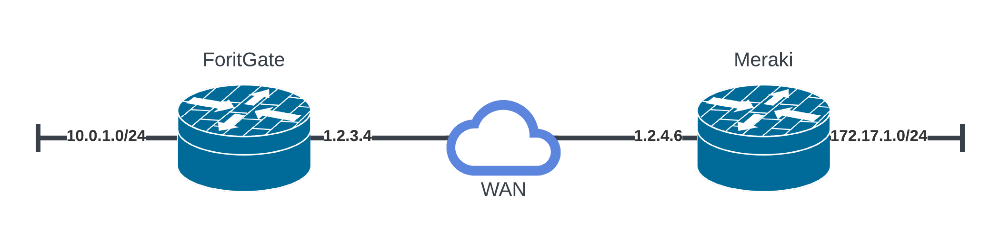
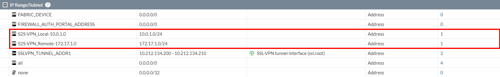
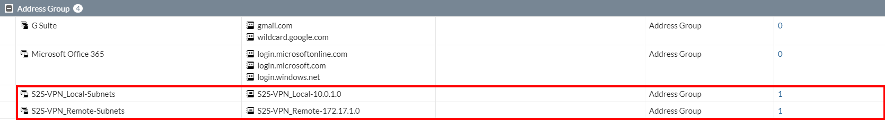
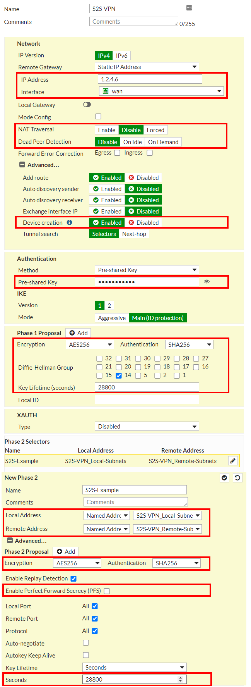
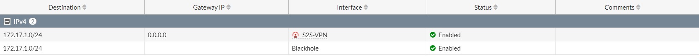
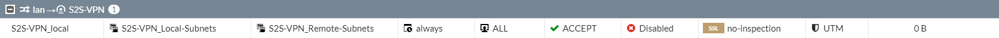
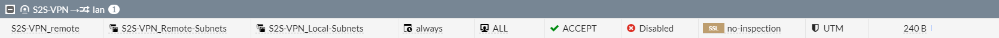
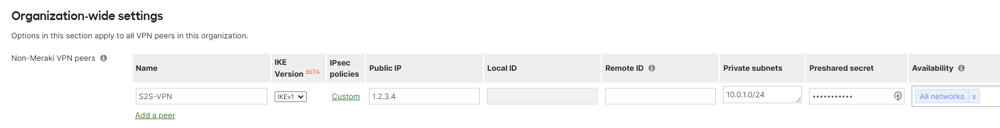
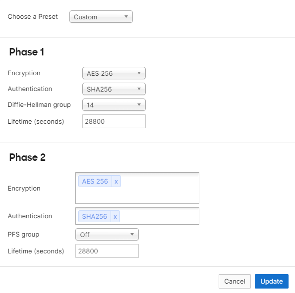
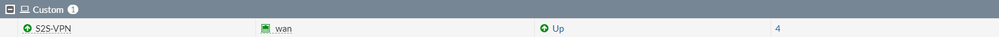

## Table of Contents

- [Network Topology](#1-network-topology)
- [FortiGate Address Objects](#2-fortigate-address-objects)
- [FortiGate Address Groups](#3-fortigate-address-groups)
- [FortiGate VPN Tunnel](#4-fortigate-vpn-tunnel)
- [FortiGate VPN Tunnel Network Section](#41-fortigate-network-section)
- [FortiGate VPN Tunnel Authentication Section](#42-fortigate-authentication-section)
- [FortiGate VPN Tunnel Phase 1 Proposal Section](#43-fortigate-phase-1-proposal-section)
- [FortiGate VPN Tunnel New Phase 2 Section](#44-fortigate-new-phase-2-section)
- [FortiGate VPN Tunnel Phase 2 Proposal Section](#45-fortigate-phase-2-proposal-section)
- [FortiGate Static Routes](#5-fortigate-static-routes)
- [FortiGate Firewall Rules](#6-fortigate-firewall-rules)
- [Meraki Site-to-Site VPN](#7-meraki-site-to-site-vpn)
- [Meraki IPsec Policies](#8-meraki-ipsec-policies)

This guide will demonstrate how to configure a simple site-to-site IPsec VPN between FortiGate and Cisco Meraki firewalls. Below is my example topology. I will begin by configuring the FortiGate. 

### 1. Network Topology

   > ||FortiGate|Meraki|
   > |-|-|-|
   > |WAN IP|1.2.3.4|1.2.4.6|
   > |LAN Subnet|10.0.1.0/24|172.17.1.0/24|

### 2. FortiGate Address Objects

   While address objects and groups aren't strictly necessary, they will help keep things simple and allow the ability to easily add additional subnets to an existing tunnel. 

   Login to the ForiGate WebUI and navigate to **Policy & Objects** and then to **Addresses**. Here we are going to create an Address object for our local and remote subnets. 

   Create an address object for the local LAN subnet (10.0.1.0/24) and remote LAN subnet (172.17.1.0/24) and give them both a meaningful name. 

   
   

### 3. FortiGate Address Groups

   Still on the **Policy & Objects > Addresses** page create Address Group objects containing the Address objects created in the first step. This will make it easier down the road to add subnets to your existing tunnels as networks change or expand as these objects can be used in tunnel and firewall rule definitions. 

   

### 4. FortiGate VPN Tunnel

   Now for the fun part. On the FortiGate UI head over to **VPN** > **IPsec Tunnels** and click on **Create New** then select **IPsec Tunnel**. On the **VPN Creation Wizard** Screen give your tunnel a meaningful name and select **Custom** for **Template type** and then choose **Next** to get started.

   Let's start filling out the **Network** section of the **New VPN Tunnel** page. I am going to simply list all the items changed from the defaults that the wizard provided. 

   

### 4.1 FortiGate Network Section

   Below are the items modified in the **Network** section of the **New VPN Tunnel** page. 

   > | Property | Value |
   > |---|---|
   > | IP Address | 1.2.4.6 |
   > | Interface | WAN |
   > | NAT Traversal | Disable |
   > | Device creation | Enabled |

### 4.2 FortiGate Authentication Section

   Below are the items modified in the **Authentication** section of the **New VPN Tunnel** page. 

   > | Property | Value |
   > |---|---|
   > | Authentication Pre-Shared Key | **make up a super-secret password and remember it for step 7** |

### 4.3 FortiGate Phase 1 Proposal Section

   Below are the items modified in the **Phase 1 Proposal** section of the **New VPN Tunnel** page. 

   Remove all items that aren’t AES256/SHA256 and use the values below. 

   > | Property | Value |
   > |---|---|
   > | Encryption | AES256 | 
   > | Authentication | SHA256 |
   > | Diffie-Hellman Group | 14 |
   > | Key Lifetime (seconds) | 28800 |

### 4.4 FortiGate New Phase 2 Section

   Below are the items modified in the **New Phase 2** section of the **New VPN Tunnel** page. 

   > | Property | Value | Value |
   > |---|---|---|
   > | Local Address | Named Address | S2S-VPN_Local-Subnets (created in step 2) |
   > | Remote Address | Named Address | S2S-VPN_Remote-Subnets (created in step 2) |

### 4.5 FortiGate Phase 2 Proposal Section

   Below are the items modified in the **Phase 2 Proposal** section of the **New VPN Tunnel** page. 

   Remove all items that aren’t AES256/SHA256 and use the values below. 

   > | Property | Value |
   > |---|---|
   > | Encryption | AES256 |
   > | Authentication | SHA256 |
   > | Enable Perfect Forward Secrecy (PFS) | Disabled |
   > | Key Lifetime Seconds | 28800 |

   After everything has been configured the **New VPN Tunnel** page should look like the image displayed at the beginning of step 4. Click **OK** to finish this step. 

### 5. FortiGate Static Routes

   If you've stuck along this far and are wondering why your tunnel hasn't established yet that is because the FortiGate requires static routes and firewall rules be setup. 
   
   Head over to **Network** and **Static Routes** and click **Create New**. For the first static route enter the LAN subnet of the remote host under **Destination**. Choose the interface named after the VPN tunnel setup in step three and click **OK**.
   
   We will also want to setup a blackhole route for the remote subnet. Click **Create New** again, enter the LAN subnet of the remote host for **Destination**. This time choose **Blackhole** as the interface and click **OK**.

   

### 6. FortiGate Firewall Rules

   We're going to need to create a couple firewall rules to allow traffic to flow between the VPN and our local network. Let's take a journey over to the **Policy & Objects** and finally to **Firewall Policy**.
   
   First, we will create the rule that allows local traffic from the FortiGate LAN to the Meraki LAN. Click **Create New** and give the new rule a meaningful name. Below are a list of values for the first rule, leave the rest at default. 
   
   > | Property | Value |
   > |---|---|
   > | Incoming Interface | LAN |
   > | Outgoing Interface | S2S-VPN |
   > | Source | S2S-VPN_Local-Subnets |
   > | Destination | S2S-VPN_Remote-Subnets |
   > | Service| All |
   > | NAT | Disabled |

   

   Next create a rule that allows the remote Meraki LAN to pass to the local FortiGate LAN. Click **Create New** and give the new rule a meaningful name. Below is a list of values for the second rule, leave the rest at default. 

   > | Property | Value |
   > |---|---|
   > | Incoming Interface | S2S-VPN |
   > | Outgoing Interface | lan |
   > | Source | S2S-VPN_Remote-Subnets |
   > | Destination | S2S-VPN_Local-Subnets |
   > | Service| All |
   > | NAT | Disabled |

   

### 7. Meraki Site-to-Site VPN

   **update the screenshot for this section**

   

   With all the work done on the FortiGate head over to the [Meraki Dashboard](https://dashboard.meraki.com) and find **Site-to-site VPN** under **Security & SD-WAN**. 
	
   On the **Site-to-site VPN** page scroll down and find **Non-Meraki VPN peers** under **Organization-wide settings** and click **Add a peer**/
	
   Below are the items modified in the **New Phase 2** section of the **New VPN Tunnel** page. 

   > | Property | Value |
   > |---|---|
   > | Name | S2S-VPN |
   > | IKE Version | IKEv1 |
   > | Public IP | 1.2.3.4 |
   > | Private subnets | 10.0.1.0/24 |
   > | Preshared secret| **Use the same value as the pre shared key in section 4.2** |
   
   Click on **Save Changes** at the bottom of the screen.
   
### 8. Meraki IPsec Policies

   

   On the newly created Non-Meraki VPN peer click on **default** under **IPsec policies**. 
   
   > | Property | Value |
   > |---|---|
   > | Preset | Custom |
   > | Phase 1 Encryption | AES 256 |
   > | Phase 1 Authentication | SHA256 |
   > | Phase 1 Diffie-Hellman group | 14 |
   > | Phase 1 Lifetime | 28800 |
   > | Phase 2 Encryption | AES 256 |
   > | Phase 2 Authentication | SHA256 |
   > | Phase 2 PFS group | Off |
   > | Phase 2 Lifetime | 28800 |

   When finished click **update** and then **save changes**. 
  
   Meraki takes a little time for the local device to update, do a continuous ping across the VPN tunnel, go grab a coffee, and when you get back you should see the tunnel is up and pings are going through. 

   