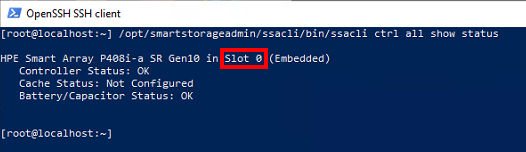
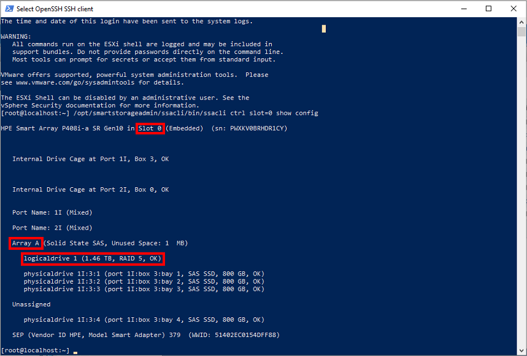
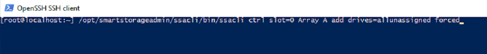
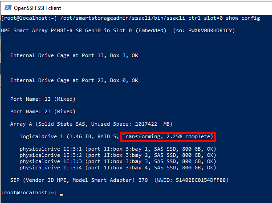
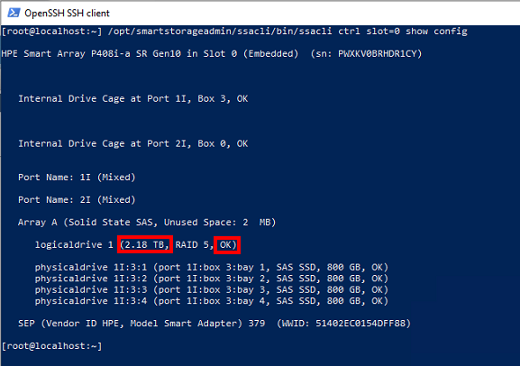

**WARNING: Before doing any work on a RAID array it’s very important to ensure that there is a current verified backup and that both the controller and array are in a healthy state.**

I will be adding a drive to an existing RAID 5 array. The host is an HPE ProLiant DL380 Gen10 with the Smart Array P408i-a with VMware ESXi 7.0.3 as the operating system. 

To manipulate the array without having to reboot the server I will be using HPE’s Smart Storage Administrator CLI. HPE offers custom ESXi images that include this tool (and more!) which I use on all new server builds. HPE also provides the VIB files to install their tools on existing servers that were set up with the stock VMware ESXi ISO. 

Without further ado, let’s get into it! Start by temporarily enabling SSH on your ESXi host and connect with your favorite SSH client.  

`/opt/smartstorageadmin/ssacli/bin/ssacli ctrl all show status` - Show all controllers in a system (used to get the ctrl slot=0)

`/opt/smartstorageadmin/ssacli/bin/ssacli ctrl slot=0 show config` - Show arrays and status for a given controller. (Used to get the Array A & also take note of initial array size)

`/opt/smartstorageadmin/ssacli/bin/ssacli ctrl slot=0 Array A add drives=allunassigned forced` - Add all unassigned drives to Array A in slot 0

`/opt/smartstorageadmin/ssacli/bin/ssacli ctrl slot=0 show config` - take note of transforming 

`/opt/smartstorageadmin/ssacli/bin/ssacli ctrl slot=0 ld 1 modify size=max forced` - Once transform is complete and status back to OK issue this to max the size.

All done! Take note of the final size.

References:

[https://www.hpe.com/us/en/servers/hpe-esxi.html](https://www.hpe.com/us/en/servers/hpe-esxi.html)